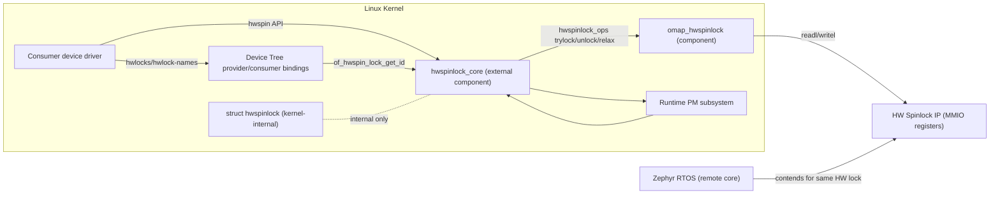
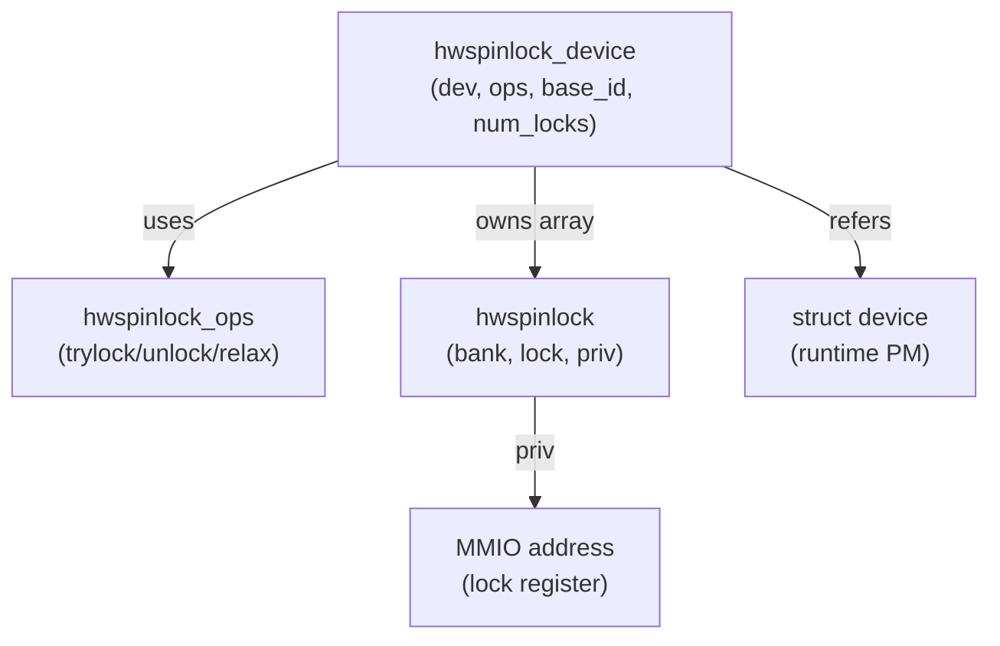
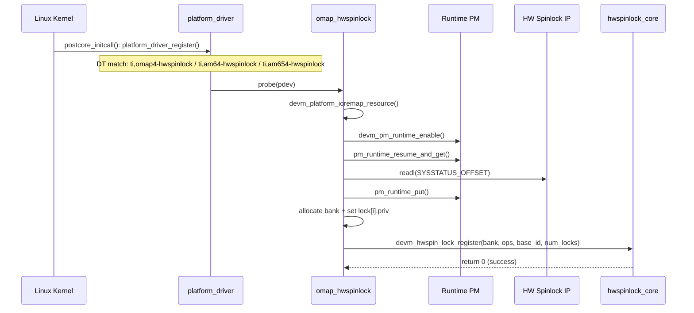
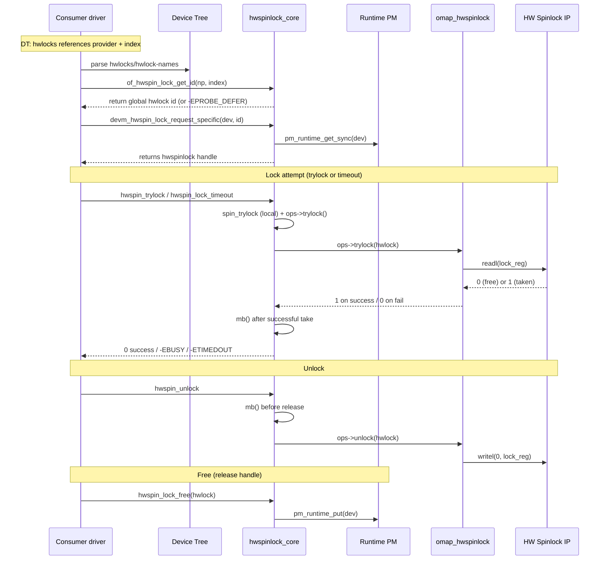
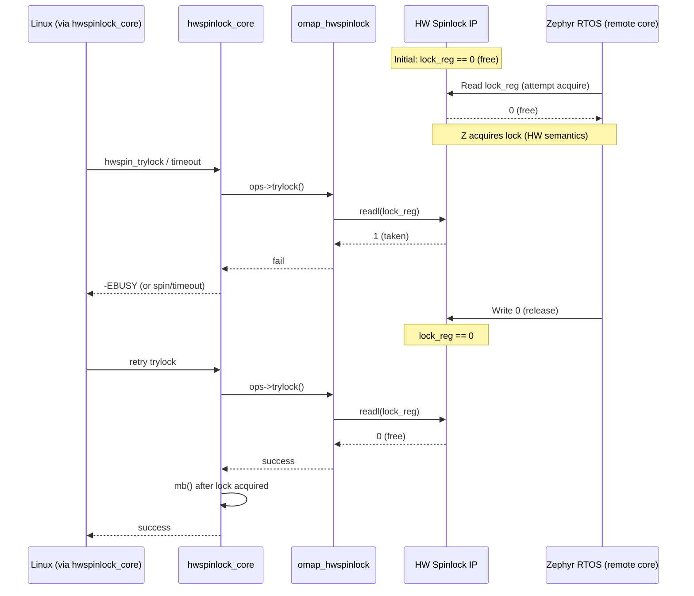

# SWE.2 Software Architecture Design (SAD)

Component: Linux Kernel `omap_hwspinlock` device driver

Document type: AUTOSAR ASPICE 4.0 - SWE.2 (Software Architectural Design)

Status: Draft

Date: 2026-01-25

## Document Control

| Item | Value |
|---|---|
| Document ID | SWE.2-DRV-HWSPINLOCK-OMAP |
| Version | 0.1 |
| Component | `omap_hwspinlock` (Linux kernel hwspinlock provider driver) |
| External dependency | `hwspinlock_core` (Linux kernel hwspinlock framework) |
| SWE.1 inputs | 2 requirements: `lock`, `unlock` |

## 1. Purpose and Scope

이 문서는 Linux Kernel의 hwspinlock subsystem 중 `omap_hwspinlock` device driver에 대한 Software Architecture를 정의한다.

범위(in-scope):
- `omap_hwspinlock` 드라이버의 정적 구조(컴포넌트/인터페이스/데이터 구조) 및 동적 동작(Init/Shutdown/Runtime, AMP contention)을 기술
- SWE.1 요구사항(`lock`, `unlock`)을 아키텍처 요소 및 근거(evidence)와 추적 가능하도록 구성

범위(out-of-scope):
- 하드웨어 TRM의 상세 레지스터 맵 전체, 전원/클럭 도메인 설계의 SoC별 세부값
- Consumer 드라이버 개별 기능 요구사항(consumer는 예시로만 다룸)

## 2. Architectural Context

### 2.1 System Context

- `omap_hwspinlock`는 TI OMAP/K3 계열 SoC의 HW Spinlock IP를 Linux hwspinlock framework에 연결하는 “thin adaptor” 역할을 수행한다.
- Consumer device drivers는 `omap_hwspinlock`을 직접 호출하지 않고, `hwspinlock_core`가 제공하는 API를 통해 hwspinlock을 request/lock/unlock/free 한다.
- Linux kernel 내부에서만 `struct hwspinlock`이 사용되며, user space에 직접 API를 노출하지 않는다.

### 2.2 Evidence Sources

이 문서의 핵심 주장(interfaces/sequence/semantics)은 아래 근거에 기반한다.

**In-repo (this workspace)**
- Driver implementation: `sources/linux/drivers/hwspinlock/omap_hwspinlock.c`
- Core implementation: `sources/linux/drivers/hwspinlock/hwspinlock_core.c`
- Internal header (kernel-internal): `sources/linux/drivers/hwspinlock/hwspinlock_internal.h`
- Public header (kernel API): `sources/linux/include/linux/hwspinlock.h`
- Kconfig/Makefile: `sources/linux/drivers/hwspinlock/Kconfig`, `sources/linux/drivers/hwspinlock/Makefile`
- DT bindings: `sources/linux/Documentation/devicetree/bindings/hwlock/ti,omap-hwspinlock.yaml`, `sources/linux/Documentation/devicetree/bindings/hwlock/hwlock.txt`

**External (public, citable)**
- Linux hwspinlock documentation: `https://docs.kernel.org/locking/hwspinlock.html`
- TI MCU+ SDK AM64x Spinlock API docs (register semantics):
  - `https://software-dl.ti.com/mcu-plus-sdk/esd/AM64X/08_05_00_24/exports/docs/api_guide_am64x/group__DRV__SPINLOCK__MODULE.html`
- Zephyr HWSPINLOCK overview (remote side abstraction rationale):
  - `https://docs.zephyrproject.org/latest/hardware/peripherals/hwspinlock.html`

## 3. Architectural Drivers

### 3.1 Functional Drivers (SWE.1)

SWE.1은 2개의 requirement로 구성됨:

- SWE.1-REQ-LOCK: HW spinlock lock을 제공한다.
- SWE.1-REQ-UNLOCK: HW spinlock unlock을 제공한다.

### 3.2 Quality / Constraint Drivers

Kernel/SoC 관점의 핵심 제약:
- No-sleep constraint: lock 획득 후 preemption/IRQ 상태에 따라 sleep 불가 (hwspinlock core 및 kernel doc에서 명시)
- Busy-wait and contention: lock 경쟁 시 polling 및 relax(delay) 수행
- Memory ordering: lock/unlock 경계에서 cross-core visibility를 위해 memory barrier 필요 (`hwspinlock_core.c`에 `mb()` 존재)
- Runtime PM: hwspinlock instance 요청/해제 시점에 runtime PM refcount가 증감 (`pm_runtime_get_sync`, `pm_runtime_put`)
- AMP environment: Linux + Zephyr가 동일 HW spinlock 자원에 경쟁 접근

## 4. Static Perspective (SWE.2.BP1)

### 4.1 Component View

Static Perspective에서는 `omap_hwspinlock`를 하나의 Component로 가정한다.

Mermaid (Context/Component):



정의/경계:
- `omap_hwspinlock`: HW register access(trylock/unlock/relax) + platform probe + bank registration
- `hwspinlock_core`: lock instance 관리(radix tree), API 제공, barrier/timeout/retry, runtime PM refcount 관리
- `struct hwspinlock`: kernel 내부에서만 사용되는 자료구조이며, consumer는 pointer handle로만 사용

### 4.1.1 Data Model (Kernel-internal)



Evidence:
- `sources/linux/drivers/hwspinlock/hwspinlock_internal.h:18-70`

### 4.2 Static Responsibilities

**`omap_hwspinlock` responsibilities**
- Register map discovery 및 lock bank 구성
  - `LOCK_BASE_OFFSET` 기반으로 `bank->lock[i].priv`에 per-lock register address를 저장 (`omap_hwspinlock.c:119-123`)
- trylock/unlock 구현
  - trylock: `readl(lock_addr)` 결과가 0(`SPINLOCK_NOTTAKEN`)이면 성공 (`omap_hwspinlock.c:38-44`)
  - unlock: `writel(0)`로 해제 (`omap_hwspinlock.c:46-52`)
- runtime PM enable 및 probe 시 SYSSTATUS 접근을 위한 일시적 power/clock enable
  - `devm_pm_runtime_enable` + `pm_runtime_resume_and_get` + `pm_runtime_put` (`omap_hwspinlock.c:87-106`)

**`hwspinlock_core` responsibilities**
- Lock instance lifecycle
  - request: `pm_runtime_get_sync(dev)`로 power on 및 tag 관리 (`hwspinlock_core.c:668-759`)
  - free: `pm_runtime_put(dev)`로 power off 가능 + tag 관리 (`hwspinlock_core.c:761-813`)
- Lock/unlock ordering
  - lock 성공 후 `mb()` (`hwspinlock_core.c:156-167`)
  - unlock 전 `mb()` 후 `ops->unlock()` (`hwspinlock_core.c:249-288`)
- Timeout/busy-wait 및 relax hook (`hwspinlock_core.c:209-247`)

### 4.2.1 Build-Time Configuration

아키텍처 관점에서 `omap_hwspinlock`은 다음 Kconfig/빌드 옵션에 의해 포함/제외된다.

- `CONFIG_HWSPINLOCK`: hwspinlock core 포함
  - Evidence: `sources/linux/drivers/hwspinlock/Makefile:6`
- `CONFIG_HWSPINLOCK_OMAP`: OMAP hwspinlock provider 드라이버 포함
  - Evidence: `sources/linux/drivers/hwspinlock/Makefile:7`, `sources/linux/drivers/hwspinlock/Kconfig:11-18`

### 4.3 Interfaces

#### 4.3.1 Provided Interfaces

**Northbound (to `hwspinlock_core`)**
- `struct hwspinlock_ops` callbacks (kernel-internal contract)
  - `.trylock`, `.unlock` are mandatory; `.relax` optional
  - Evidence: `sources/linux/drivers/hwspinlock/hwspinlock_internal.h:18-35`

**DT Provider Interface**
- Compatible strings and `#hwlock-cells`
  - Evidence: `sources/linux/Documentation/devicetree/bindings/hwlock/ti,omap-hwspinlock.yaml:12-36`

#### 4.3.2 Required Interfaces

- Linux platform driver model (`platform_driver`, `probe`)
- MMIO access: `devm_platform_ioremap_resource`, `readl`, `writel`
- Runtime PM: `devm_pm_runtime_enable`, `pm_runtime_resume_and_get`, `pm_runtime_put`

#### 4.3.3 Consumer Binding Interface

Generic hwlock consumer properties:
- Required: `hwlocks`
- Optional: `hwlock-names`
  - Evidence: `sources/linux/Documentation/devicetree/bindings/hwlock/hwlock.txt:14-35`

#### 4.3.4 Representative Consumer Examples (evidence-only)

Consumer는 DT에서 `hwlocks`를 통해 provider를 참조하고, `of_hwspin_lock_get_id()`로 id를 얻은 뒤 `devm_hwspin_lock_request_specific()`로 handle을 요청하는 패턴이 흔하다.

예시(이 repo 내 Linux kernel tree):
- `sources/linux/drivers/iio/adc/sc27xx_adc.c:897-907`
- `sources/linux/drivers/nvmem/sprd-efuse.c:384-394`
- `sources/linux/drivers/soc/qcom/smem.c:1192-1206` (lock/unlock irqsave 사용)
- `sources/linux/drivers/base/regmap/regmap.c:394-435` (timeout + unlock 사용)

## 5. Dynamic Perspective (SWE.2.BP2)

Dynamic Perspective에서는 Linux kernel의 Init(Boot/Reset), Shutdown, Runtime의 세 뷰를 `sequenceDiagram`으로 표현하고, AMP contention을 별도 시퀀스로 추가한다.

### 5.1 Init / Boot / Reset View



핵심 관찰:
- probe 시점에는 lock count discovery를 위해 일시적으로 PM ref를 잡고 SYSSTATUS를 읽는다.
- 이후 core registration이 완료되면, 실제 runtime power/clock 관리는 주로 `hwspinlock_core`가 request/free 시점에 수행한다.

### 5.2 Runtime View (Linux consumer path)



핵심 관찰:
- `mb()`는 `omap_hwspinlock`가 아니라 `hwspinlock_core`에서 수행한다.
- Runtime PM refcount는 request/free 시점에 증감한다 (`pm_runtime_get_sync`, `pm_runtime_put`).

### 5.3 Shutdown View

```mermaid
sequenceDiagram
  participant C as Consumer driver
  participant CORE as hwspinlock_core
  participant PM as Runtime PM
  participant PD as platform_driver

  Note over C,PM: consumer unbind / devres cleanup
  C->>CORE: devm cleanup triggers hwspin_lock_free()
  CORE->>PM: pm_runtime_put(dev)

  Note over PD: provider unload (module)
  PD->>PD: module_exit(): platform_driver_unregister()
  Note over PD: unregister requires locks unused; otherwise -EBUSY possible
```

### 5.4 AMP Contention View (Linux vs Zephyr)

이 시퀀스는 Zephyr 내부 구현을 상세화하지 않고, “remote core가 동일 HW spinlock register protocol을 수행한다”는 시스템 가정 하에 표현한다.



AMP 관련 설계 리스크/제약:
- Power/clock domain ownership: Linux의 runtime PM이 spinlock block clock을 gating하는 경우, remote(Zephyr)가 lock을 사용 중인데 Linux가 PM을 내려버리면 undefined behavior 가능. 따라서 AMP 제품에서는 spinlock block의 전원/클럭 정책을 시스템 레벨에서 명확히 해야 한다.

## 6. Error Handling and Failure Modes

주요 error/failure 케이스:
- Probe 단계
  - `pm_runtime_resume_and_get` 실패: probe 실패로 드라이버 등록 불가 (`omap_hwspinlock.c:91-95`)
  - SYSSTATUS 기반 lock count 인코딩 오류: `-EINVAL` (`omap_hwspinlock.c:108-110`)
- Runtime 단계
  - lock busy: `__hwspin_trylock`이 `-EBUSY` 반환 (`hwspinlock_core.c:128-154`)
  - lock timeout: `__hwspin_lock_timeout`이 `-ETIMEDOUT` 반환 (`hwspinlock_core.c:209-235`)
  - DT 기반 lock id 획득 실패: `-EPROBE_DEFER`, `-EINVAL`, `-ENOENT` (`hwspinlock_core.c:355-451` 영역)
  - PM power-on 실패: `pm_runtime_get_sync` 실패 시 request 실패 (`hwspinlock_core.c:691-698`)

## 7. Resource and Timing Considerations (SWE.2.BP5)

- Busy-wait: lock 경쟁 시 polling이 발생하며 interconnect hogging 가능
- Relax delay:
  - OMAP driver relax: `ndelay(50)` (`omap_hwspinlock.c:64-67`)
  - Core atomic retry delay: `HWSPINLOCK_RETRY_DELAY_US=100` (`hwspinlock_core.c:27-28`)
- 사용 가이드(공개 문서): lock hold time은 예측 가능하고 짧아야 하며, lock을 잡은 상태에서 preempt/suspend/interrupt로 장시간 지연되면 안 된다 (TI MCU+ SDK spinlock usage guideline)

## 8. Design Decisions and Rationale

- Thin adaptor pattern
  - 레지스터 접근은 driver가 담당, 정책(재시도/timeout/barrier/PM)은 core가 담당
- Memory ordering은 core에서 제공
  - lock 성공 이후 `mb()` (`hwspinlock_core.c:156-167`)
  - unlock 전에 `mb()` 후 `ops->unlock()` (`hwspinlock_core.c:273-288`)
- Runtime PM refcount는 lock instance request/free에 묶임
  - request: `pm_runtime_get_sync` (`hwspinlock_core.c:691-698`)
  - free: `pm_runtime_put` (`hwspinlock_core.c:797-799`)
- base_id=0 고정(현재 드라이버 구현 가정)
  - multi-bank 구성 시 base_id 정책이 확장 포인트가 될 수 있으나 본 driver는 “single block device”만 지원 (`omap_hwspinlock.c:80-82`)

## 9. Traceability (SWE.2.BP4)

| SWE.1 Requirement | Statement | Architectural element | Evidence |
|---|---|---|---|
| SWE.1-REQ-LOCK | HW spinlock lock 제공 | `omap_hwspinlock_trylock()` + `hwspinlock_core::__hwspin_trylock()` | `sources/linux/drivers/hwspinlock/omap_hwspinlock.c:38-44`, `sources/linux/drivers/hwspinlock/hwspinlock_core.c:92-170` |
| SWE.1-REQ-UNLOCK | HW spinlock unlock 제공 | `omap_hwspinlock_unlock()` + `hwspinlock_core::__hwspin_unlock()` | `sources/linux/drivers/hwspinlock/omap_hwspinlock.c:46-52`, `sources/linux/drivers/hwspinlock/hwspinlock_core.c:249-306` |

## 10. Verification Plan / Test Plan

### Success Criteria (Binary)

- Static Perspective
  - `omap_hwspinlock`와 `hwspinlock_core`가 분리된 컴포넌트로 기술되고, consumer는 core를 통해서만 접근한다고 명확히 서술된다.
  - DT provider/consumer binding(`ti,omap-hwspinlock`, `hwlocks`, `#hwlock-cells`)이 문서에 포함된다.
  - 제공/요구 인터페이스가 최소 1회 이상 명시적으로 나열된다.

- Dynamic Perspective
  - Init(Boot/Reset), Shutdown, Runtime sequenceDiagram이 모두 존재한다.
  - Runtime sequenceDiagram에서 `mb()` 위치가 core 기준으로 명시된다(락 성공 후 / 언락 전).
  - request/free에서 runtime PM get/put이 표현된다.
  - AMP contention(Linux vs Zephyr) 시퀀스가 존재한다.

- Traceability
  - SWE.1-REQ-LOCK/UNLOCK가 아키텍처 요소와 소스 근거로 추적 가능하다.

### Test Plan

Objective: 본 SWE.2 문서의 정합성과 다이어그램 유효성을 검증한다.

Prerequisites:
- Mermaid 렌더링 가능한 Markdown viewer(GitHub/GitLab preview 또는 `mmdc` 등)

Test Cases:
1. Mermaid 렌더링: 모든 Mermaid 블록이 파싱/렌더링 오류 없이 표시된다.
2. Evidence check: Traceability 표의 각 Evidence path/line이 실제 소스와 일치한다.
3. Consistency check: Runtime PM 및 barrier 위치가 `hwspinlock_core.c`와 일치한다.
4. Completeness check: Static+Dynamic+Traceability가 모두 포함된다.

Success Criteria: 모든 Test Case가 PASS.

## Appendix A. Key Evidence Excerpts (optional)

### A.1 OMAP driver semantics

- `omap_hwspinlock.c:42-44`:
  - "attempt to acquire the lock by reading its value" / `readl(lock_addr)`
- `omap_hwspinlock.c:50-52`:
  - "release the lock by writing 0 to it" / `writel(0, lock_addr)`

### A.2 Core barriers and PM

- `hwspinlock_core.c:166-167`: `mb()` after successful lock
- `hwspinlock_core.c:285-288`: `mb()` before `ops->unlock()`
- `hwspinlock_core.c:691-698`: `pm_runtime_get_sync(dev)` on request
- `hwspinlock_core.c:797-799`: `pm_runtime_put(dev)` on free

### A.3 TI Spinlock register semantics (public)

TI MCU+ SDK 문서는 SPINLOCK 레지스터의 read/write 시맨틱을 공개적으로 기술한다.

- AM64x MCU+ SDK `Spinlock_lock`:
  - "This API performs the Read operation for Lock status of the SPINLOCK_LOCK_REG, in order to acquire a Spinlock."
  - Evidence: `https://software-dl.ti.com/mcu-plus-sdk/esd/AM64X/08_05_00_24/exports/docs/api_guide_am64x/group__DRV__SPINLOCK__MODULE.html`
- AM64x MCU+ SDK `Spinlock_unlock`:
  - "Write 0x0: Set the lock to Not Taken(Free)" / "Write 0x1: No update to the lock value."
  - Evidence: `https://software-dl.ti.com/mcu-plus-sdk/esd/AM64X/08_05_00_24/exports/docs/api_guide_am64x/group__DRV__SPINLOCK__MODULE.html`
