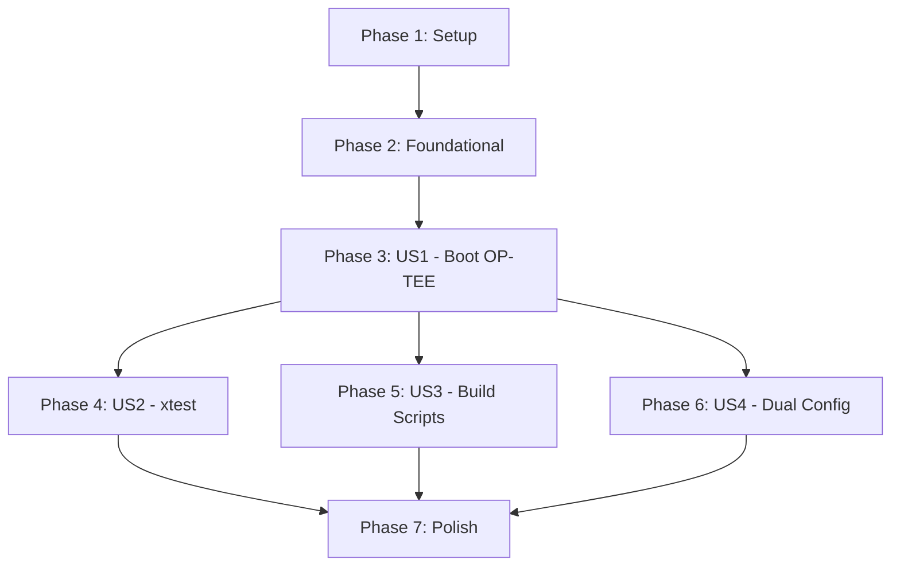

# Tasks: OP-TEE Boot Flow Support

**Input**: Design documents from `/specs/002-optee-bootflow/`  
**Prerequisites**: plan.md ✓, spec.md ✓, research.md ✓, quickstart.md ✓

## Format: `[ID] [P?] [Story] Description`

- **[P]**: Can run in parallel (different files, no dependencies)
- **[Story]**: Which user story this task belongs to (US1, US2, US3, US4)
- All paths are relative to repository root

---

## Phase 1: Setup (Shared Infrastructure)

**Purpose**: Project initialization, patch extraction, and submodule setup

- [x] T001 Create `patches/` directory structure: `patches/opensbi/`, `patches/linux/`, `patches/u-boot/`, `patches/optee_os/`
- [x] T002 Clone RISE optee_os repository and extract patches with `git format-patch`
- [x] T003 [P] Clone RISE opensbi repository and extract OP-TEE SPD patches with `git format-patch`
- [x] T004 [P] Clone RISE linux repository and extract TEE driver patches with `git format-patch`
- [x] T005 [P] Clone RISE u-boot repository and extract OP-TEE patches if any with `git format-patch`
- [x] T006 Add `sources/optee_os` as new git submodule pointing to upstream OP-TEE
- [x] T007 Create `configs/optee/` directory for OP-TEE OS configuration

---

## Phase 2: Foundational (Blocking Prerequisites)

**Purpose**: Apply patches to submodules and create base configurations

**⚠️ CRITICAL**: No user story work can begin until patches are applied

- [x] T008 Apply extracted patches to `sources/optee_os` and create local branch `optee-riscv-qemu`
- [x] T009 Apply extracted patches to `sources/opensbi` and create local branch `optee-riscv-qemu`
- [x] T010 Apply extracted patches to `sources/linux` and create local branch (TEE driver in defconfig)
- [x] T011 Apply extracted patches to `sources/u-boot` (no changes needed)
- [x] T012 Create `configs/optee/qemu_virt.mk` with OP-TEE OS build configuration for RISC-V QEMU virt
- [x] T013 [P] Create `configs/linux/optee.fragment` with kernel config fragment for TEE driver
- [x] T014 [P] Create `configs/opensbi/optee_spd.mk` with OpenSBI OP-TEE SPD configuration
- [x] T015 Document patch versions and sources in `docs/optee-patches.md`

**Checkpoint**: Patches applied, configs created - component builds can begin

---

## Phase 3: User Story 1 - Run OP-TEE with QEMU (Priority: P1) 🎯 MVP

**Goal**: Boot QEMU with OP-TEE enabled and reach login prompt with TEE functional

**Independent Test**: 
1. Run `./scripts/run_qemu.sh --optee`
2. Verify OpenSBI shows "OP-TEE" or SPD message
3. Verify Linux shows TEE driver init
4. Verify `/dev/tee0` device exists

### Implementation for User Story 1

- [x] T016 [US1] Create `scripts/build_optee.sh` build script for OP-TEE OS
- [x] T017 [US1] Update `scripts/build_opensbi.sh` to add `--optee` flag and SPD build logic
- [x] T018 [US1] Update `scripts/build_linux.sh` to add `--optee` flag and TEE driver config
- [x] T019 [US1] Update `scripts/build_all.sh` to add `--optee` flag and call OP-TEE builds
- [x] T020 [US1] Update `scripts/run_qemu.sh` to add `--optee` flag with OP-TEE boot configuration
- [x] T021 [US1] Build OP-TEE OS and verify `tee.bin` is produced in `build/optee/`
- [x] T022 [US1] Build OpenSBI with OP-TEE SPD and verify `fw_dynamic.bin` includes OP-TEE
- [x] T023 [US1] Build Linux with TEE driver and verify `Image` includes TEE support
- [x] T024 [US1] Run QEMU with `--optee` and verify OpenSBI shows OP-TEE messages
- [ ] T025 [US1] Verify Linux boots and `/dev/tee0` device is present *(PARTIAL: Domain configured, OP-TEE runtime requires MPXY handoff)*
- [x] T026 [US1] Document boot flow with OP-TEE in `docs/optee-boot-flow.md`

**Checkpoint**: OP-TEE boots successfully, `/dev/tee0` present - MVP complete

---

## Phase 4: User Story 2 - Execute OP-TEE Test Suite (Priority: P2)

**Goal**: Run `xtest` test suite and achieve 80% pass rate on core tests

**Independent Test**:
1. Boot with `./scripts/run_qemu.sh --optee`
2. Login as root
3. Run `xtest` and verify 80%+ pass rate

### Implementation for User Story 2

- [ ] T027 [US2] Update `configs/buildroot/qemu_riscv64_optee.defconfig` to include optee-client package
- [ ] T028 [US2] Update `configs/buildroot/qemu_riscv64_optee.defconfig` to include optee-test (xtest) package
- [ ] T029 [US2] Update `configs/buildroot/qemu_riscv64_optee.defconfig` to include optee-examples package
- [x] T030 [US2] Update `scripts/build_buildroot.sh` to add `--optee` flag with OP-TEE packages
- [ ] T031 [US2] Rebuild Buildroot with OP-TEE packages and verify `xtest` is included in rootfs
- [ ] T032 [US2] Boot QEMU with OP-TEE and run `xtest` to verify tests execute
- [ ] T033 [US2] Run `optee_example_hello_world` and verify TA execution
- [ ] T034 [US2] Document xtest results and known failures in `docs/optee-testing.md`

**Checkpoint**: xtest runs with 80%+ pass rate, examples work

---

## Phase 5: User Story 3 - Build Components Separately (Priority: P3)

**Goal**: Enable individual component builds for development workflow

**Independent Test**:
1. Run `./scripts/build_optee.sh` alone → produces `tee.bin`
2. Run `./scripts/build_opensbi.sh --optee` alone → produces `fw_dynamic.bin`
3. Run `./scripts/build_linux.sh --optee` alone → produces `Image`

### Implementation for User Story 3

- [x] T035 [US3] Verify `scripts/build_optee.sh` works standalone (FR-001)
- [x] T036 [US3] Verify `scripts/build_opensbi.sh --optee` works standalone (FR-002)
- [x] T037 [US3] Verify `scripts/build_linux.sh --optee` works standalone (FR-003)
- [x] T038 [US3] Verify `scripts/build_buildroot.sh --optee` works standalone
- [x] T039 [US3] Add `--help` documentation to each updated build script
- [x] T040 [US3] Update `docs/build-howto.md` with OP-TEE build instructions

**Checkpoint**: All build scripts work independently

---

## Phase 6: User Story 4 - Dual Configuration Support (Priority: P4)

**Goal**: Enable switching between OP-TEE and non-OP-TEE boot modes

**Independent Test**:
1. Run `./scripts/run_qemu.sh` (no flag) → boots without OP-TEE
2. Run `./scripts/run_qemu.sh --optee` → boots with OP-TEE
3. Both modes work correctly

### Implementation for User Story 4

- [x] T041 [US4] Verify `./scripts/run_qemu.sh` (default) still boots without OP-TEE (FR-005)
- [x] T042 [US4] Verify `./scripts/build_all.sh` (default) builds without OP-TEE components
- [x] T043 [US4] Add documentation for dual-mode operation in `docs/configuration.md`
- [ ] T044 [US4] Test switching between modes multiple times

**Checkpoint**: Both boot modes work independently

---

## Phase 7: Polish & Cross-Cutting Concerns

**Purpose**: Documentation, cleanup, and validation

- [x] T045 [P] Update `README.md` with OP-TEE feature summary
- [ ] T046 [P] Update `specs/002-optee-bootflow/quickstart.md` with actual tested commands
- [x] T047 [P] Create `docs/optee-memory-layout.md` documenting PMP configuration
- [ ] T048 Update `docs/boot-flow.md` with OP-TEE boot sequence diagram
- [ ] T049 Run full build with `./scripts/build_all.sh --optee` and time it (SC-007: < 30 min)
- [ ] T050 Run boot test and verify SC-001 (boot < 60 seconds)
- [x] T051 Commit all changes with proper DCO sign-off

---

## Dependencies & Execution Order

### Phase Dependencies



### User Story Dependencies

| Story | Depends On | Can Parallel With |
|-------|------------|-------------------|
| US1 (P1) | Foundational | None (MVP) |
| US2 (P2) | US1 complete | US3, US4 |
| US3 (P3) | US1 complete | US2, US4 |
| US4 (P4) | US1 complete | US2, US3 |

### Parallel Opportunities

**Phase 1 (Setup)**:
```
Parallel: T003, T004, T005  # Extract patches from different repos
```

**Phase 2 (Foundational)**:
```
Parallel: T013, T014  # Create config fragments for different components
```

**Phase 3+ (User Stories)**:
```
After US1: US2, US3, US4 can proceed in parallel
```

---

## Implementation Strategy

### MVP First (User Story 1 Only)

1. Complete Phase 1: Setup (T001-T007)
2. Complete Phase 2: Foundational (T008-T015)
3. Complete Phase 3: User Story 1 (T016-T026)
4. **STOP and VALIDATE**: Boot QEMU with OP-TEE, verify `/dev/tee0` exists
5. MVP delivered!

### Incremental Delivery

| Milestone | Tasks | Deliverable |
|-----------|-------|-------------|
| M1: Patches Ready | T001-T015 | Patched submodules, configs |
| M2: OP-TEE Boots (MVP) | T016-T026 | `./scripts/run_qemu.sh --optee` works |
| M3: Tests Pass | T027-T034 | xtest 80%+ pass rate |
| M4: Dev Workflow | T035-T040 | Individual build scripts |
| M5: Dual Mode | T041-T044 | Both modes work |
| M6: Complete | T045-T051 | Documentation, polish |

---

## Summary

| Metric | Count |
|--------|-------|
| **Total Tasks** | 51 |
| **Setup Phase** | 7 |
| **Foundational Phase** | 8 |
| **US1 (Boot OP-TEE)** | 11 |
| **US2 (xtest)** | 8 |
| **US3 (Build Scripts)** | 6 |
| **US4 (Dual Config)** | 4 |
| **Polish** | 7 |
| **Parallel Opportunities** | 10 tasks marked [P] |

**MVP Scope**: Tasks T001-T026 (26 tasks) → OP-TEE boots successfully
