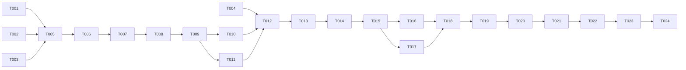

# Tasks: OpenSBI WorldGuard Support

**Feature Branch**: `003-opensbi-worldguard`  
**Plan**: [plan.md](./plan.md)  
**Spec**: [spec.md](./spec.md)  
**Created**: 2025-12-06

## Summary

| Metric | Value |
|--------|-------|
| Total Tasks | 24 |
| Phase 1 (Setup) | 4 tasks |
| Phase 2 (US1 - Hardcoded Test) | 7 tasks |
| Phase 3 (US2 - Device Tree) | 6 tasks |
| Phase 4 (US3 - wgChecker) | 5 tasks |
| Phase 5 (Polish) | 2 tasks |
| Parallel Opportunities | 6 tasks |

---

## Phase 1: Setup

**Goal**: OpenSBI 빌드 환경 확인 및 WorldGuard 개발 준비

- [ ] T001 Verify OpenSBI source exists at `sources/opensbi/`
- [ ] T002 [P] Test baseline OpenSBI build with `make PLATFORM=generic CROSS_COMPILE=riscv64-linux-gnu-`
- [ ] T003 [P] Verify QEMU WorldGuard support with `./scripts/run-qemu-worldguard.sh` boots to U-Boot
- [ ] T004 Create QEMU DTB dump script at `scripts/dump-qemu-dtb.sh`

---

## Phase 2: User Story 1 - 하드코딩 테스트 코드로 WorldGuard 초기화

**Goal**: OpenSBI에 하드코딩된 WorldGuard CSR 초기화 추가

**Independent Test**: QEMU 부팅 시 OpenSBI 로그에 `WorldGuard: enabled` 메시지 확인

### Implementation

- [ ] T005 [US1] Create WorldGuard CSR header at `sources/opensbi/include/sbi/riscv_worldguard.h`
- [ ] T006 [US1] Implement WorldGuard init module at `sources/opensbi/lib/sbi/sbi_worldguard.c`
- [ ] T007 [US1] Add WorldGuard object to build system at `sources/opensbi/lib/sbi/objects.mk`
- [ ] T008 [US1] Add WorldGuard init call to `sources/opensbi/lib/sbi/sbi_init.c` in `init_coldboot()`
- [ ] T009 [US1] Build OpenSBI with WorldGuard support
- [ ] T010 [US1] Test WorldGuard enabled boot with `wg=on` - verify log output
- [ ] T011 [US1] Test WorldGuard disabled boot (no `wg` option) - verify silent skip

---

## Phase 3: User Story 2 - Device Tree 기반 WID 및 CSR 설정

**Goal**: Device Tree에서 WorldGuard 설정을 읽어 CSR 초기화

**Independent Test**: DT의 `trustedwid` 값 변경 시 `mlwid` CSR이 해당 값으로 설정됨

**Depends On**: US1 완료

### Implementation

- [ ] T012 [US2] Dump QEMU DTB with `scripts/dump-qemu-dtb.sh` to `dts/qemu-virt.dts`
- [ ] T013 [US2] Create WorldGuard DTS overlay at `dts/worldguard-overlay.dts`
- [ ] T014 [US2] Add FDT parsing to `sources/opensbi/lib/sbi/sbi_worldguard.c` for `riscv,worldguard` node
- [ ] T015 [US2] Implement `nworlds`, `trustedwid` property parsing in `sbi_worldguard.c`
- [ ] T016 [US2] Test with modified DTS - change `trustedwid` and verify `mlwid` value in log
- [ ] T017 [US2] Test with missing WorldGuard DT node - verify silent skip

---

## Phase 4: User Story 3 - Device Tree 기반 wgChecker 설정

**Goal**: Device Tree에서 wgChecker 슬롯을 읽어 MMIO에 프로그래밍

**Independent Test**: DT에 정의된 슬롯 값이 wgChecker MMIO에 정확히 반영됨

**Depends On**: US2 완료

### Implementation

- [ ] T018 [US3] Add wgChecker register definitions to `sources/opensbi/include/sbi/riscv_worldguard.h`
- [ ] T019 [US3] Implement wgChecker slot parsing from DT (`slots = <addr size perm>` array)
- [ ] T020 [US3] Implement wgChecker MMIO programming in `sbi_worldguard.c`
- [ ] T021 [US3] Add slot lock bit setting after programming
- [ ] T022 [US3] Test wgChecker slot programming with QEMU debug output

---

## Phase 5: Polish & Verification

**Goal**: 최종 검증 및 문서화

- [ ] T023 Full boot test: OpenSBI → U-Boot → Linux → Buildroot login with WorldGuard enabled
- [ ] T024 Update `docs/worldguard.md` with OpenSBI integration documentation

---

## Dependencies



---

## Parallel Execution Opportunities

### Phase 1 Parallel
```
T002 ─┬─ (parallel)
T003 ─┘
```

### Phase 2 (US1) Parallel
```
T010 ─┬─ (parallel after T009)
T011 ─┘
```

### Phase 3 (US2) Parallel
```
T016 ─┬─ (parallel after T015)
T017 ─┘
```

---

## Implementation Strategy

### MVP Scope (Recommended First Milestone)

**Target**: Phase 1 + Phase 2 (US1) = 11 tasks

**Deliverable**: 하드코딩된 WorldGuard CSR 초기화가 동작하는 OpenSBI

**Verification**:
1. OpenSBI 빌드 성공
2. `wg=on`으로 부팅 시 로그에 `WorldGuard: enabled, mlwid=3, slwid=2` 출력
3. `wg=off`로 부팅 시 WorldGuard 관련 로그 없음

### Incremental Delivery

| Milestone | Tasks | Output |
|-----------|-------|--------|
| M1: MVP | T001-T011 | Hardcoded WorldGuard init |
| M2: DT Config | T012-T017 | Flexible DT-based config |
| M3: wgChecker | T018-T022 | Memory protection programming |
| M4: Final | T023-T024 | Full integration + docs |

---

## Estimated Effort

| Phase | Tasks | Time |
|-------|-------|------|
| Setup | 4 | 1h |
| US1 | 7 | 4h |
| US2 | 6 | 4h |
| US3 | 5 | 4h |
| Polish | 2 | 1h |
| **Total** | **24** | **~14h** |
