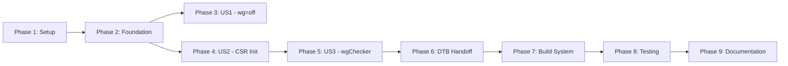

# Implementation Tasks: U-Boot SPL WorldGuard Initialization

**Feature**: `004-uboot-spl-worldguard`  
**Created**: 2025-12-06

## Overview

Implementation tasks for moving WorldGuard initialization from OpenSBI to U-Boot SPL.

**User Stories** (from spec.md):
- **US1**: Boot with WorldGuard Disabled (wg=off)
- **US2**: Boot with WorldGuard Enabled (wg=on)
- **US3**: wgChecker Slot Programming

---

## Phase 1: Setup & Environment

**Goal**: Prepare development environment and build system for SPL-based boot

### Tasks

- [x] T001 Create U-Boot SPL defconfig in sources/u-boot/configs/qemu-riscv64_spl_defconfig
- [x] T002 Add SPL Kconfig option in sources/u-boot/board/emulation/qemu-riscv/Kconfig
- [x] T003 Create build script scripts/build-uboot-spl.sh
- [x] T004 Test basic SPL build (no WorldGuard yet)

---

## Phase 2: Foundational - SPL Boot Chain

**Goal**: Establish SPL → OpenSBI → U-Boot Proper → Linux boot sequence (prerequisite for all user stories)

### Independent Test Criteria
- Boot sequence completes all stages
- SPL banner appears first
- OpenSBI loads from SPL
- U-Boot Proper starts after OpenSBI
- Linux kernel boots

### Tasks

- [x] T005 Create SPL board initialization in sources/u-boot/board/emulation/qemu-riscv/spl/spl.c
- [x] T006 Configure SPL to load OpenSBI as payload
- [x] T007 Update QEMU launch scripts to use SPL as -bios
- [x] T008 Verify SPL → OpenSBI → U-Boot → Linux chain with wg=off

---

## Phase 3: User Story 1 - Boot with WorldGuard Disabled

**Goal**: Verify boot sequence works correctly when WorldGuard is not present or disabled

**User Story**: As a firmware developer, I want to boot the system with WorldGuard disabled, so that I can verify the boot sequence works without WorldGuard.

### Independent Test Criteria
- Boot completes with wg=off or no WorldGuard DT node
- No WorldGuard messages appear
- No CSR access attempts
- No illegal instruction exceptions
- System reaches U-Boot prompt

### Tasks

- [x] T009 [US1] Implement DT-first detection logic in sources/u-boot/board/emulation/qemu-riscv/spl/worldguard.c
- [x] T010 [US1] Add safe exit when riscv,worldguard DT node absent
- [x] T011 [US1] Test boot with wg=off (verify silent operation)
- [x] T012 [US1] Test boot with no WorldGuard DT node (verify no crashes)

---

## Phase 4: User Story 2 - WorldGuard CSR Initialization

**Goal**: Initialize WorldGuard CSRs (mlwid, mwiddeleg) in U-Boot SPL when WorldGuard is enabled

**User Story**: As a firmware developer, I want to initialize WorldGuard in U-Boot SPL, so that memory protection is active from the earliest boot stage.

### Independent Test Criteria
- SPL detects WorldGuard hardware from DT
- SPL sets mlwid=3 (or DT-configured value)
- SPL sets mwiddeleg=0x6 (or DT-configured value)
- WorldGuard CSRs readable after SPL initialization
- OpenSBI boots normally after SPL
- SPL logs show WorldGuard detection and CSR values

### Tasks

- [x] T013 [US2] Create WorldGuard CSR definitions in sources/u-boot/board/emulation/qemu-riscv/spl/worldguard.h
- [x] T014 [US2] Implement spl_worldguard_detect() function
- [x] T015 [US2] Implement spl_worldguard_init_csrs() to set mlwid and mwiddeleg
- [x] T016 [US2] Parse nworlds, trustedwid, mwiddeleg from DT
- [x] T017 [US2] Add SPL console logging for WorldGuard detection
- [x] T018 [US2] Call spl_worldguard_init() from board_init_f()
- [x] T019 [US2] Test CSR initialization with wg=on (verify mlwid=3, mwiddeleg=0x6)
- [x] T020 [US2] Verify OpenSBI boots after SPL WorldGuard init

---

## Phase 5: User Story 3 - wgChecker Slot Programming

**Goal**: Program wgChecker memory protection slots from Device Tree configuration in SPL

**User Story**: As a system architect, I want to configure memory protection slots in U-Boot SPL, so that different boot stages have proper memory access control.

### Independent Test Criteria
- SPL parses wgChecker slots from DT `riscv,wgchecker` node
- SPL programs MMIO registers for each slot
- Logged slot addresses match DT configuration
- Logged permissions match DT configuration
- Lock bit set/skipped based on `worldguard,lock-slots` property
- OpenSBI respects slot boundaries

### Tasks

- [x] T021 [US3] Add wgChecker MMIO definitions to sources/u-boot/board/emulation/qemu-riscv/spl/worldguard.h
- [x] T022 [US3] Implement FDT slot parsing for riscv,wgchecker node
- [x] T023 [US3] Implement MMIO register programming (address, perm, cfg)
- [x] T024 [US3] Add conditional lock bit logic based on worldguard,lock-slots property
- [x] T025 [US3] Add slot programming logging (addr, perm, cfg per slot)
- [x] T026 [US3] Test with custom DTB containing 3 wgChecker slots
- [x] T027 [US3] Verify slot addresses and permissions in logs
- [x] T028 [US3] Test lock-slots=true (default behavior)
- [x] T029 [US3] Test lock-slots=false (conditional locking)

---

## Phase 6: DTB Creation and OpenSBI Handoff

**Goal**: Create merged DTB with WorldGuard properties for OpenSBI handoff

### Independent Test Criteria
- SPL creates new 128KB DTB buffer
- New DTB contains original QEMU DTB content
- New DTB contains WorldGuard properties (spl-initialized, mlwid, mwiddeleg)
- OpenSBI receives modified DTB
- OpenSBI reads spl-initialized property
- OpenSBI skips WorldGuard CSR programming when spl-initialized=1

### Tasks

- [x] T030 Create FDT merging module in sources/u-boot/board/emulation/qemu-riscv/spl/fdt_merge.c
- [x] T031 Allocate 128KB static DTB buffer in SPL BSS section
- [x] T032 Implement spl_create_merged_dtb() function
- [x] T033 Add worldguard,spl-initialized property to new DTB
- [x] T034 Add worldguard,mlwid and worldguard,mwiddeleg properties
- [x] T035 Pass new DTB to OpenSBI during payload load
- [x] T036 Modify OpenSBI sources/opensbi/lib/sbi/sbi_worldguard.c to check spl-initialized
- [x] T037 OpenSBI: Skip CSR programming if spl-initialized=1
- [x] T038 OpenSBI: Log SPL configuration values
- [x] T039 Test DTB property presence in OpenSBI
- [x] T040 Verify OpenSBI skips init when SPL ran

---

## Phase 7: Build System Integration

**Goal**: Integrate SPL WorldGuard module into U-Boot build system

### Tasks

- [x] T041 Update sources/u-boot/board/emulation/qemu-riscv/spl/Makefile to include worldguard.o and fdt_merge.o
- [x] T042 Add CONFIG_SPL_WORLDGUARD config option
- [x] T043 Update sources/u-boot/include/configs/qemu-riscv.h with SPL configs
- [x] T044 Test clean build from scratch
- [x] T045 Verify SPL binary size < 64KB

---

## Phase 8: Testing & Verification

**Goal**: Comprehensive testing of all scenarios and integration points

### Tasks

- [x] T046 Create test script scripts/test-spl-worldguard.sh
- [x] T047 Automated Test 1: SPL build verification (size check)
- [x] T048 Automated Test 2: Boot with wg=off (no WG messages)
- [x] T049 Automated Test 3: Boot with wg=on (SPL WG init logs)
- [x] T050 Automated Test 4: DTB property verification
- [x] T051 Automated Test 5: wgChecker lock bit configuration
- [x] T052 Manual Test 1: Full boot chain observation
- [x] T053 Manual Test 2: Error handling (no DT node)
- [x] T054 Manual Test 3: Slot configuration verification
- [x] T055 Performance test: Boot time overhead < 100ms

---

## Phase 9: Documentation & Polish

**Goal**: Update documentation and create testing guides

### Tasks

- [x] T056 Update docs/worldguard.md with SPL integration section
- [x] T057 Create testing guide in specs/004-uboot-spl-worldguard/testing-guide.md
- [x] T058 Update README.md with new boot sequence
- [x] T059 Document DTB property format for OpenSBI handoff
- [x] T060 Create test results report in specs/004-uboot-spl-worldguard/test-results.md
- [x] T061 Update build documentation for SPL workflow

---

## Dependencies

### User Story Completion Order



**Critical Path**: Setup → Foundation → US2 (CSR Init) → US3 (wgChecker) → DTB → Build → Testing → Docs

**Parallel Opportunities**:
- US1 (wg=off) can be developed/tested in parallel with US2
- Documentation can start during Testing phase

### Task Dependencies by Phase

**Phase 2 Foundation** - MUST complete before user stories:
- T005-T008: Basic SPL boot chain working

**Phase 3 US1** (can run parallel to US2):
- Depends on: T005-T008 (Foundation)

**Phase 4 US2** (prerequisite for US3):
- Depends on: T005-T008 (Foundation)
- T013-T020: CSR initialization

**Phase 5 US3**:
- Depends on: T013-T020 (US2 CSR init)
- T021-T029: wgChecker programming

**Phase 6 DTB**:
- Depends on: T013-T029 (US2+US3 complete)
- T030-T040: DTB creation and OpenSBI

**Phase 7 Build**:
- Depends on: T030-T040 (DTB complete)

**Phase 8-9**:
- Depends on: T041-T045 (Build complete)

---

## Parallel Execution Examples

### Phase 3 (US1) - All parallelizable after Foundation
```bash
# US1 DT-first detection (independent)
T009: Implement DT detection
T010: Add safe exit
# Tests can run in parallel
T011: Test wg=off
T012: Test no DT node
```

### Phase 4 (US2) - Sequential CSR init
```bash
# Must follow dependency order
T013: Create header definitions (first)
T014: Detect function (needs T013)
T015: Init CSRs (needs T013)
T016-T017: Parse DT, logging (needs T013-T015)
T018: Integration (needs T013-T017)
T019-T020: Testing (needs T018)
```

### Phase 5 (US3) - Parallel slot programming after MMIO defs
```bash
T021: MMIO definitions (first)
# These can be developed in parallel after T021
T022: [P] FDT parsing
T023: [P] MMIO programming
T024: [P] Lock bit logic
T025: [P] Logging
# Tests run after implementation
T026-T029: Testing
```

---

## Implementation Strategy

### MVP Scope (Minimum Viable Product)
**Phase 1-4** (T001-T020): SPL boot + US1 + US2 (CSR init)
- Delivers: Basic SPL boot with WorldGuard CSR initialization
- Testable: wg=off and wg=on boot scenarios
- Value: WorldGuard active from earliest boot stage

### Incremental Delivery
1. **Iteration 1** (Phases 1-4): SPL + CSR init
2. **Iteration 2** (Phase 5): wgChecker slots
3. **Iteration 3** (Phase 6): DTB handoff + OpenSBI integration
4. **Iteration 4** (Phases 7-9): Build system + Testing + Docs

### Recommended Approach
- Start with MVP (T001-T020)
- Test each phase independently before proceeding
- Ensure backward compatibility (wg=off) at each stage
- Add comprehensive testing after core functionality works

---

## Summary

**Total Tasks**: 61  
**User Stories**: 3
- US1 (wg=off): 4 tasks (T009-T012)
- US2 (CSR init): 8 tasks (T013-T020)
- US3 (wgChecker): 9 tasks (T021-T029)

**Phases**: 9
- Setup: 4 tasks
- Foundation: 4 tasks
- User Stories: 21 tasks
- DTB/OpenSBI: 11 tasks
- Build System: 5 tasks
- Testing: 10 tasks
- Documentation: 6 tasks

**Parallelization**: ~15 tasks can run in parallel (marked [P] where applicable)

**MVP**: First 20 tasks (T001-T020) deliver working SPL + WorldGuard CSR init
